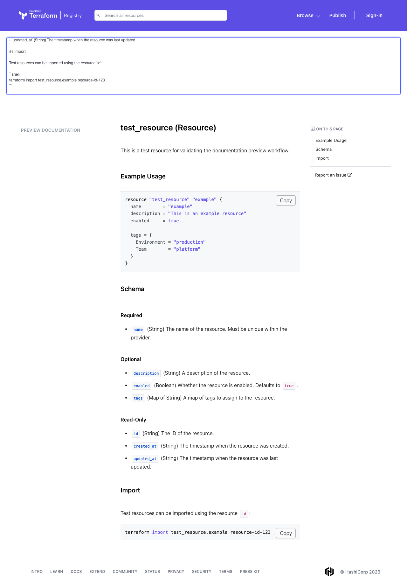
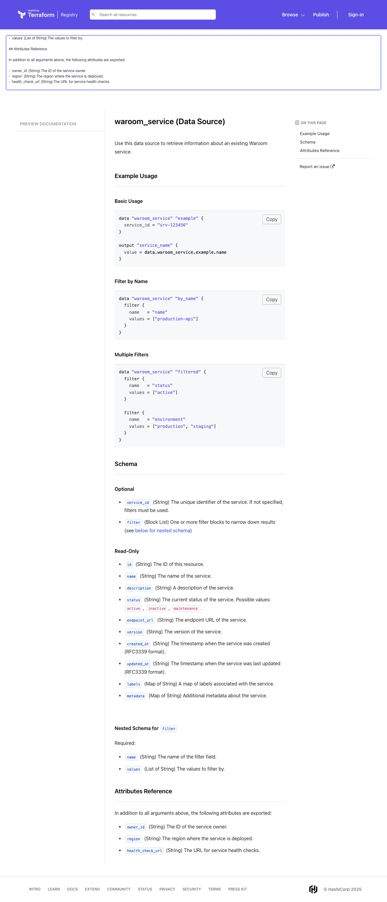

# Terraform Docs Preview Action

A GitHub Actions reusable workflow for automatically previewing Terraform Provider documentation using the official Terraform Registry doc-preview tool.

## Features

- Automatically captures screenshots of documentation using [Terraform Registry's doc-preview tool](https://registry.terraform.io/tools/doc-preview)
- Ensures documentation renders exactly as it will appear in the Terraform Registry
- Reusable workflow that can be integrated into any Terraform Provider repository
- No Node.js dependencies required in your provider repository
- **Pluggable storage backends**: Supports multiple object storage providers (AWS S3, Google Cloud Storage, Azure Blob Storage, Cloudflare R2, etc.)

## Preview Examples

See how your Terraform Provider documentation will look in the Terraform Registry:

<table>
<tr>
<td width="50%">

**Resource Documentation**



📄 [View source markdown](examples/docs/resource-example.md)

</td>
<td width="50%">

**Data Source Documentation**



📄 [View source markdown](examples/docs/data-source-example.md)

</td>
</tr>
</table>

These preview images are automatically generated and posted as comments on your pull requests, making it easy for reviewers to see exactly how documentation changes will appear.

## Usage

Create a workflow file in your Terraform Provider repository (e.g., `.github/workflows/doc-preview.yaml`):

```yaml
name: Documentation Preview

on:
  pull_request:
    paths:
      - 'docs/**/*.md'

permissions:
  id-token: write    # Required for OIDC authentication
  contents: read
  pull-requests: write

jobs:
  docs-preview:
    uses: Sho2010/terraform-docs-preview-action/.github/workflows/terraform-docs-preview.yaml@main
    with:
      docs_path: docs
      aws_region: ap-northeast-1
      role_to_assume: ${{ vars.ROLE_TO_ASSUME }}
      bucket: ${{ vars.BUCKET }}
      key_prefix: terraform-docs-previews
      expires_in: "3600"
      allow_fork: "false"
      use_public_url: "true"  # REQUIRED when using OIDC authentication
```

## Inputs

| Input | Description | Required | Default |
|-------|-------------|----------|---------|
| `docs_path` | Path to the documentation directory | No | `docs` |
| `aws_region` | AWS region for S3 bucket | Yes | - |
| `role_to_assume` | ARN of the IAM role to assume for AWS credentials | Yes | - |
| `bucket` | S3 bucket name for storing preview images | Yes | - |
| `key_prefix` | Prefix for S3 object keys | No | `terraform-docs-previews` |
| `expires_in` | Expiration time in seconds for presigned URLs (ignored when `use_public_url` is true) | No | `3600` |
| `use_public_url` | Generate public S3 URLs instead of presigned URLs. **Must be set to `"true"` when using OIDC authentication.** Requires bucket policy for public read access. | No | `"false"` |
| `allow_fork` | Whether to allow uploads from forked repositories. Set to `"true"` to enable. | No | `"false"` |

**Important Notes:**
- The workflow automatically detects changed markdown files in the specified `docs_path` directory
- ⚠️ When using OIDC authentication (recommended), you **must** set `use_public_url: "true"` - presigned URLs will not work with temporary OIDC credentials

### Custom Documentation Directory

If your documentation is in a different directory (e.g., `documentation/`), adjust both the path filter and the `docs_path` input:

```yaml
on:
  pull_request:
    paths:
      - 'documentation/**/*.md'

permissions:
  id-token: write
  contents: read
  pull-requests: write

jobs:
  docs-preview:
    uses: Sho2010/terraform-docs-preview-action/.github/workflows/terraform-docs-preview.yaml@main
    with:
      docs_path: documentation
      aws_region: ap-northeast-1
      role_to_assume: ${{ vars.ROLE_TO_ASSUME }}
      bucket: ${{ vars.BUCKET }}
      key_prefix: terraform-docs-previews
      expires_in: "3600"
      allow_fork: "false"
      use_public_url: "true"
```

## How It Works

The workflow consists of multiple jobs that work together:

1. **Change Detection** (`detect` job): Uses `tj-actions/changed-files` to detect changed `.md` files in the specified `docs_path` directory
2. **Screenshot Generation** (`generate` job): For each changed file:
   - Reads the markdown content
   - Navigates to the Terraform Registry doc-preview tool
   - Pastes the content into the preview
   - Captures a screenshot using Playwright
   - Stores screenshots as GitHub Actions artifacts
3. **Storage Upload** (`upload-s3` job):
   - Downloads the screenshot artifacts
   - Uploads them to S3 bucket
   - Generates either presigned URLs or public URLs based on `use_public_url` setting
4. **PR Comment** (`comment` job): Posts preview image URLs to the pull request for easy review

The workflow automatically handles the entire pipeline and only runs when markdown files are actually changed.

## Examples

See the [examples](examples/) directory for sample documentation files and their generated previews:
- [Resource documentation example](examples/docs/resource-example.md)
- [Data source documentation example](examples/docs/data-source-example.md)

## Configuration

### AWS S3 Setup

This action requires AWS credentials to upload preview images to S3. The recommended approach is to use OIDC (OpenID Connect) for secure, keyless authentication.

> **⚠️ CRITICAL**: When using OIDC authentication (recommended), presigned URLs **will not work**. You **must** configure your workflow with `use_public_url: "true"` and set up a bucket policy for public read access. See the "Public URL vs Presigned URL" section below for details.

#### Required AWS Resources

1. **S3 Bucket**: Create a bucket to store preview images
2. **IAM Role**: Create an IAM role with OIDC trust relationship for GitHub Actions
3. **Bucket Policy** (if using `use_public_url: "true"`): Configure bucket policy to allow public read access

#### IAM Role Permissions

The IAM role needs the following permissions:

```json
{
  "Version": "2012-10-17",
  "Statement": [
    {
      "Effect": "Allow",
      "Action": [
        "s3:PutObject",
        "s3:GetObject"
      ],
      "Resource": "arn:aws:s3:::your-bucket-name/terraform-docs-previews/*"
    }
  ]
}
```

#### Public URL vs Presigned URL

> **⚠️ IMPORTANT**: When using OIDC authentication (recommended), presigned URLs **will not work** because OIDC provides temporary credentials that expire before the presigned URL can be used. **You must use `use_public_url: "true"`** when authenticating with OIDC.

- **Presigned URL** (`use_public_url: "false"`, default): Temporary URLs that expire after `expires_in` seconds.
  - ⚠️ **Does not work with OIDC authentication** - requires long-lived AWS credentials
  - Only use this if you're using AWS access keys (not recommended for security reasons)

- **Public URL** (`use_public_url: "true"`, **recommended**): Permanent public URLs.
  - ✅ **Works with OIDC authentication**
  - Requires bucket policy for public read access (see below)

```json
{
  "Version": "2012-10-17",
  "Statement": [
    {
      "Sid": "PublicReadGetObject",
      "Effect": "Allow",
      "Principal": "*",
      "Action": "s3:GetObject",
      "Resource": "arn:aws:s3:::your-bucket-name/terraform-docs-previews/*"
    }
  ]
}
```

### GitHub Repository Setup

Store your AWS configuration as repository variables or secrets:

- `ROLE_TO_ASSUME`: ARN of the IAM role (e.g., `arn:aws:iam::123456789012:role/github-actions-role`)
- `BUCKET`: S3 bucket name

You can use GitHub repository variables for non-sensitive values or secrets for sensitive information.

## Local Testing

To test the preview script locally:

```bash
# Install dependencies
npm install

# Install Playwright browsers
npx playwright install chromium

# Run the preview script with example files
node scripts/preview-docs.js examples/docs/resource-example.md

# Check the generated screenshot
ls screenshots/
```

## Requirements

- Node.js 24.0.0 or higher
- Playwright (automatically installed in the workflow)

## License

MIT License - see [LICENSE](LICENSE) file for details.
